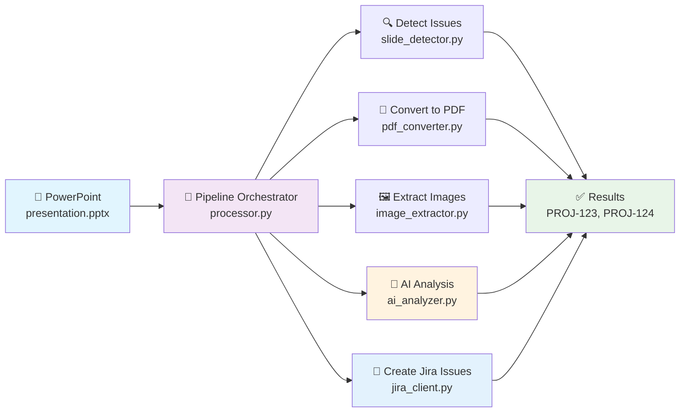

# PowerPoint to Jira Issues - AI Enhanced Converter

This tool automatically detects issues mentioned in slides in PowerPoint presentations and creates Jira issues using AI-powered content analysis. 

## 📋 Prerequisites

### Software Requirements

1. **LibreOffice** (for PDF conversion)
   ```bash
   # macOS
   brew install libreoffice
   
   # Ubuntu/Debian
   sudo apt-get install libreoffice
   
   # Windows
   # Download from https://www.libreoffice.org/
   ```

2. **Python 3.8+** with required packages

### API Access

1. **Jira Cloud API Token**
   - Go to [Atlassian Account Settings](https://id.atlassian.com/manage-profile/security/api-tokens)
   - Create API token
   - Note your Jira base URL and email

2. **OpenAI API Key**
   - Get API key from [OpenAI Platform](https://platform.openai.com/api-keys)
   - Ensure you have access to GPT-4o or GPT-4-turbo

## 🛠 Installation

1. **Clone or download the project**
   ```bash
   git clone <repository-url>
   cd jira-pptx-converter
   ```

2. **Install Python dependencies**
   ```bash
   pip install -r requirements.txt
   ```

3. **Set up environment variables**
   Edit `.env` file:
   ```bash
   # Jira Configuration
   JIRA_BASE_URL=https://yourorg.atlassian.net
   JIRA_EMAIL=your-email@company.com
   JIRA_API_TOKEN=your-api-token
   JIRA_PROJECT_KEY=PROJ

   # OpenAI Configuration
   OPENAI_API_KEY=your-openai-api-key
   OPENAI_MODEL=gpt-4.1

   # Processing Configuration (Optional)
   MAX_IMAGE_SIZE_MB=1.0
   MAX_CONCURRENT_REQUESTS=5
   LIBREOFFICE_COMMAND=soffice
   ```

| Variable | Description | Required | Default |
|----------|-------------|----------|---------|
| `JIRA_BASE_URL` | Your Jira instance URL | ✅ | - |
| `JIRA_EMAIL` | Your Jira account email | ✅ | - |
| `JIRA_API_TOKEN` | Jira API token | ✅ | - |
| `JIRA_PROJECT_KEY` | Target project key | ✅ | - |
| `OPENAI_API_KEY` | OpenAI API key | ✅ | - |
| `OPENAI_MODEL` | OpenAI model to use | ❌ | gpt-4.1 |
| `MAX_IMAGE_SIZE_MB` | Maximum image size in MB | ❌ | 1.0 |
| `MAX_CONCURRENT_REQUESTS` | Max parallel API requests | ❌ | 5 |
| `LIBREOFFICE_COMMAND` | LibreOffice executable path | ❌ | soffice |

## 🔧 Usage

### Basic Usage

```bash
# Dry run to preview what would be created
python main.py presentation.pptx --dry-run

# Create actual Jira issues
python main.py presentation.pptx

# Use a different project key (override .env setting)
python main.py presentation.pptx --project-key MYPROJ

# Debug mode - keep temporary files for inspection
python main.py presentation.pptx --dry-run --debug
```

### Command Line Options

```bash
python main.py [OPTIONS] PPTX_FILE

Arguments:
  PPTX_FILE                    Path to the PowerPoint presentation

Options:
  -d, --dry-run               Show what would be created without actually creating issues
  --debug                     Keep temporary PDF and image files for debugging
  -p, --project-key           Jira project key (overrides JIRA_PROJECT_KEY from .env)
  -t, --max-concurrent        Maximum concurrent API requests (default: 5)
  -h, --help                  Show help message
```

## 🏗️ Architecture Overview

```
project/
├── main.py                  # 🚀 Entry point + result display (119 lines)
├── processor.py             # 🎯 Pipeline orchestrator + temp utils (107 lines)  
├── config.py                # ⚙️ Configuration + constants (71 lines)
├── ai_analyzer.py           # 🤖 AI analysis + SlideAnalysis model (171 lines)
├── jira_client.py           # 🔗 Jira operations (160 lines)
├── slide_detector.py        # 📋 Issue slide detection (40 lines)
├── pdf_converter.py         # 📄 PDF conversion (63 lines)
├── image_extractor.py       # 🖼️  Image extraction (84 lines)
└── requirements.txt         # 📦 Dependencies
```

The application processes presentations through a clean 5-step pipeline with full parallelization:

### 🔍 Issue Detection Patterns

The tool automatically detects slides that contain issues using these patterns:

| Pattern | Description | Example |
|---------|-------------|---------|
| `Issue:` | Lines starting with "Issue:" (case-insensitive) | "Issue: Database connection fails" |
| `Bug:` | Lines starting with "Bug:" (case-insensitive) | "Bug: Login validation error" |

**Detection Logic:**
- Scans all text shapes in each slide
- Uses regex pattern matching for reliable detection
- Case-insensitive matching for flexibility
- Must appear at the beginning of a line (^ anchor)



## 📊 Example Output

```
============================================================
Slide 6: E. coli contamination detection issue with PK-0 classification
Priority: High
Type: Bug
Jira Issue: PROJ-123
Description:
### Problem
E. coli should not be classified as PK-0 when ANI=NANI=98.17 and 
NANI_real_diff > 0.2 with Sec.hit >= 200...

### Evidence & Data
- ANI = NANI = 98.17
- PK-0: NANI_real_diff > 0.2
- sec.hit >= 200

### Proposed Next Steps
- Review contamination filtering logic
- Update PK-0 classification criteria

Labels: contamination, filtering, slide-6
============================================================
Total processing time: 17.14 seconds
```
