# PowerPoint to Jira Issues - AI Enhanced Converter

This tool automatically detects issues mentioned in slides in PowerPoint presentations and creates Jira issues using AI-powered content analysis. 


## 🎯 Rule-Based Project Classification

When `JIRA_PROJECT_KEY` is not specified, the system uses simple text pattern matching to determine the appropriate project:

### Project Determination Rules
| Issue Title Pattern         | Project | Example                                   |
|----------------------------|---------|-------------------------------------------|
| Starts with "DB issue:"     | **DB**  | "DB issue: Streptococcus sobrinus low ANI"|
| Starts with "Coj issue:"    | **COJ** | "Coj issue: Judging error"                |
| Starts with "AJ issue:"     | **AJ**  | "AJ issue: Timeout on test case"          |
| Starts with "Issue:"        | **AP**  | "Issue: Pipeline performance slow"        |
| Starts with "Bug:"          | **AP**  | "Bug: Memory leak in pipeline"            |
| All other patterns          | **AP**  | "Issue: Frontend bug in login form"       |

## 🔧 Usage

### Basic Usage

```bash
# Dry run to preview what would be created
python main.py presentation.pptx -d

# Create actual Jira issues
python main.py presentation.pptx

# Use a specific project key (disables rule-based project determination)
python main.py presentation.pptx --project-key DB
```

### Command Line Options

```bash
python main.py [OPTIONS] PPTX_FILE

Arguments:
  PPTX_FILE                    Path to the PowerPoint presentation

Options:
  -d, --dry-run               Show what would be created without actually creating issues
  --debug                     Keep temporary PDF and image files for debugging
  -p, --project-key           Jira project key (overrides .env and disables rule-based project determination)
  -t, --max-concurrent        Maximum concurrent API requests (default: 5)
  -h, --help                  Show help message
```

## 📋 Prerequisites

### Software Requirements

1. **LibreOffice** (for PDF conversion)
   ```bash
   # macOS
   brew install libreoffice
   
   # Ubuntu/Debian
   sudo apt-get install libreoffice
   
   # Windows
   # Download from https://www.libreoffice.org/
   ```

2. **Python 3.8+** with required packages

### API Access

1. **Jira Cloud API Token**
   - Go to [Atlassian Account Settings](https://id.atlassian.com/manage-profile/security/api-tokens)
   - Create API token
   - Note your Jira base URL and email

2. **OpenAI API Key**
   - Get API key from [OpenAI Platform](https://platform.openai.com/api-keys)
   - Ensure you have access to GPT-4.1 or GPT-4-turbo

## 🛠 Installation

1. **Clone or download the project**
   ```bash
   git clone <repository-url>
   cd Slide2Jira
   ```

2. **Install Python dependencies**
   ```bash
   pip install -r requirements.txt
   ```

3. **Set up environment variables**
   Edit `.env` file:
   ```bash
   # Jira Configuration
   JIRA_BASE_URL=https://yourorg.atlassian.net
   JIRA_EMAIL=your-email@company.com
   JIRA_API_TOKEN=your-api-token
   JIRA_PROJECT_KEY=DB    # Optional - if not set, rules determine project

   # OpenAI Configuration
   OPENAI_API_KEY=your-openai-api-key
   OPENAI_MODEL=gpt-4.1

   # Processing Configuration (Optional)
   MAX_IMAGE_SIZE_MB=2.0
   MAX_CONCURRENT_REQUESTS=5
   LIBREOFFICE_COMMAND=soffice
   ```

| Variable                | Description                        | Required | Default    |
|-------------------------|------------------------------------|----------|------------|
| `JIRA_BASE_URL`         | Your Jira instance URL              | ✅       | -          |
| `JIRA_EMAIL`            | Your Jira account email             | ✅       | -          |
| `JIRA_API_TOKEN`        | Jira API token                      | ✅       | -          |
| `JIRA_PROJECT_KEY`      | Target project key (optional)       | ❌       | Rule-based |
| `OPENAI_API_KEY`        | OpenAI API key                      | ✅       | -          |
| `OPENAI_MODEL`          | OpenAI model to use                 | ❌       | gpt-4.1    |
| `MAX_IMAGE_SIZE_MB`     | Maximum image size in MB            | ❌       | 2.0        |
| `MAX_CONCURRENT_REQUESTS`| Max parallel API requests           | ❌       | 5          |
| `LIBREOFFICE_COMMAND`   | LibreOffice executable path         | ❌       | soffice    |

## 🏗️ Architecture Overview

```
project/
├── main.py                  # 🚀 Entry point + result display
├── processor.py             # 🎯 Pipeline orchestrator + temp utils
├── config.py                # ⚙️ Configuration + constants
├── ai_analyzer.py           # 🤖 AI analysis + SlideAnalysis model
├── jira_client.py           # 🔗 Jira operations
├── slide_detector.py        # 📋 Issue slide detection
├── pdf_converter.py         # 📄 PDF conversion
├── image_extractor.py       # 🖼️  Image extraction
└── requirements.txt         # 📦 Dependencies
```

The application processes presentations through a clean 5-step pipeline with full parallelization:

### 🔍 Issue Detection Patterns

The tool automatically detects slides that contain issues using these patterns:

| Pattern           | Description                                   | Example                                   |
|-------------------|-----------------------------------------------|-------------------------------------------|
| `Issue:`          | Lines starting with "Issue:" (case-insensitive) | "Issue: Database connection fails"        |
| `Bug:`            | Lines starting with "Bug:" (case-insensitive)   | "Bug: Login validation error"             |
| `DB issue:`       | Lines starting with "DB issue:" (case-insensitive) | "DB issue: Streptococcus sobrinus low ANI"|
| `Coj issue:`      | Lines starting with "Coj issue:" (case-insensitive) | "Coj issue: Judging error"                |
| `AJ issue:`       | Lines starting with "AJ issue:" (case-insensitive)  | "AJ issue: Timeout on test case"          |

**Detection Logic:**
- Scans all text shapes in each slide
- Uses regex pattern matching for reliable detection
- Case-insensitive matching for flexibility
- Must appear at the beginning of a line (^ anchor)

```mermaid
flowchart LR
    A["📄 PowerPoint<br/>presentation.pptx"] --> O["🎯 Pipeline Orchestrator<br/>processor.py"]
    
    O --> B["🔍 Detect Issues<br/>slide_detector.py"]
    O --> C["📄 Convert to PDF<br/>pdf_converter.py"]
    O --> D["🖼️ Extract Images<br/>image_extractor.py"]
    O --> E["🤖 AI Analysis<br/>ai_analyzer.py"]
    O --> F["🎫 Create Jira Issues<br/>jira_client.py"]
    
    B --> G["✅ Results<br/>DB-123, AP-124, COJ-125, AJ-126"]
    C --> G
    D --> G
    E --> G
    F --> G
    
    style A fill:#e1f5fe
    style O fill:#f3e5f5
    style G fill:#e8f5e8
    style E fill:#fff3e0
    style F fill:#e3f2fd
```



#### Adding New Rules
To add project-specific rules, modify `config.py`:

```python
ISSUE_PROJECT_RULES = {
    r"(?i)(?:^|\n)db issue:": "DB",      # Database issues
    r"(?i)(?:^|\n)coj issue:": "COJ",    # Cojudge issues
    r"(?i)(?:^|\n)aj issue:": "AJ",      # Autojudge issues
    r"(?i)(?:^|\n)issue:": "AP",         # General issues
    r"(?i)(?:^|\n)(bug):": "AP",         # Bugs
}

DEFAULT_PROJECT_KEY = "AP"  # Fallback for unmatched patterns
```
